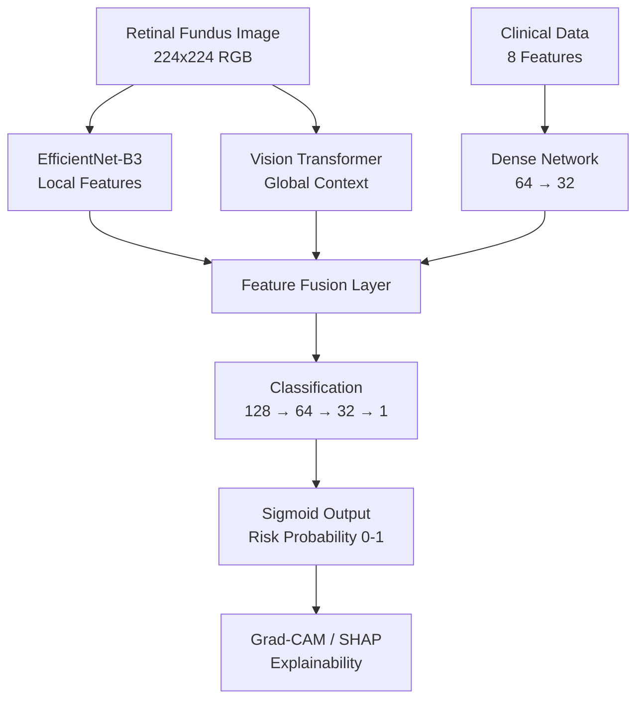

# CardioRetina-AI

> Research-to-product AI system for non-invasive cardiovascular risk prediction from retinal fundus images.


---

> **IMPORTANT DISCLAIMER:** This project is a research prototype for educational and experimental use only. It is not intended for clinical diagnosis, treatment decisions, or as a substitute for professional medical advice. Always consult a qualified healthcare professional.

---

## Problem Statement

Cardiovascular disease (CVD) remains the leading cause of mortality worldwide. Traditional screening methods are often invasive, expensive, and inaccessible. Recent research has established that the retinal vasculature shares embryological and physiological properties with the coronary vasculature, making retinal fundus imaging a potential non-invasive window into cardiovascular health.

**CardioRetina-AI** leverages deep learning to analyze retinal fundus images alongside clinical health metrics to predict heart disease risk, enabling early screening in settings where traditional cardiac imaging may be unavailable.

## Why Retinal Images?

The retinal microvasculature is the only directly observable vascular bed in the human body. Changes in retinal vessel caliber, tortuosity, and branching patterns have been associated with:
- Hypertension and atherosclerosis
- Coronary artery disease
- Stroke risk
- Diabetic vascular complications

## Architecture



| Component | Details |
|-----------|---------|
| **CNN Backbone** | EfficientNet-B3 (ImageNet pretrained, frozen early layers) |
| **ViT Module** | ViT-Base-Patch16-224 with projection layer |
| **Clinical Network** | Dense 64→32 for 8 health metrics |
| **Fusion** | Concatenation → 128→64→32 with BatchNorm + Dropout |
| **Output** | Sigmoid → [0, 1] risk probability |
| **Loss** | Binary Cross-Entropy |
| **Optimizer** | Adam (lr=0.001, weight_decay=1e-4) |
| **Scheduler** | ReduceLROnPlateau (patience=5, factor=0.5) |
| **Early Stopping** | patience=10 |

## Features

- **Hybrid CNN + ViT architecture** for complementary local and global feature extraction
- **Multimodal clinical data fusion** (age, BP, cholesterol, BMI, smoking, diabetes, physical activity)
- **Explainable AI**: Grad-CAM heatmaps highlighting diagnostic retinal regions + SHAP clinical feature importance
- **Ablation study support**: CNN-only, ViT-only, CNN+ViT, CNN+ViT+Clinical configurations
- **FastAPI inference API** with `/predict`, `/health`, `/model-info`, `/metrics`, `/gradcam/{id}` endpoints
- **Modern web dashboard** with drag-drop upload, clinical form, risk gauge, and Grad-CAM visualization
- **Complete evaluation pipeline**: accuracy, precision, recall, specificity, F1, AUC-ROC, confusion matrix, PR curve
- **Docker support** with GPU capability and healthcheck
- **GitHub Actions CI/CD** with lint, test, import check, and model forward pass verification
- **ONNX export** for deployment optimization
- **Research documentation**: MODEL_CARD.md, DATASET.md, REPRODUCIBILITY.md

## Installation

```bash
# Clone repository
git clone https://github.com/aarohidev91/cardioretina-ai.git
cd cardioretina-ai

# Install dependencies
pip install -e ".[dev]"

# Copy environment configuration
cp .env.example .env
```

### Requirements

- Python 3.10+
- PyTorch 2.0+
- CUDA (optional, for GPU acceleration)

## Dataset Format

The training pipeline expects a CSV file with the following columns:

| Column | Type | Description |
|--------|------|-------------|
| `image_path` | str | Relative path to retinal fundus image |
| `label` | int | 0 (low risk) or 1 (high risk) |
| `age` | float | Patient age in years |
| `systolic_bp` | float | Systolic blood pressure (mmHg) |
| `diastolic_bp` | float | Diastolic blood pressure (mmHg) |
| `cholesterol` | float | Total cholesterol (mg/dL) |
| `bmi` | float | Body Mass Index |
| `smoking` | int | 0=No, 1=Yes |
| `diabetes` | int | 0=No, 1=Yes |
| `physical_activity` | int | 0=Sedentary, 1=Active |

See [DATASET.md](DATASET.md) for detailed format specification and preprocessing notes.

### Validate Dataset

```bash
python -m cardioretina.data.validate path/to/dataset.csv --image-dir path/to/images/
```

### Split Dataset

```bash
python -m cardioretina.data.split path/to/dataset.csv --output-dir data/splits/
```

## Training

```bash
# Train with default configuration
python -m cardioretina.training.train --data-csv data/dataset.csv --image-dir data/images/

# Train with custom config
python -m cardioretina.training.train --data-csv data/dataset.csv --image-dir data/images/ --config config/default.yaml

# Override hyperparameters
python -m cardioretina.training.train --data-csv data/dataset.csv --image-dir data/images/ --epochs 100 --batch-size 32 --lr 0.0005
```

Training outputs:
- `checkpoints/best_model.pt` - Best model checkpoint
- `outputs/training_history.json` - Training metrics per epoch
- `outputs/training_history.csv` - Training metrics in CSV format
- `outputs/experiment_log.json` - Experiment metadata
- `outputs/config_snapshot.yaml` - Configuration used

## Evaluation

```bash
python -m cardioretina.evaluation.evaluate \
    --checkpoint checkpoints/best_model.pt \
    --test-csv data/splits/test.csv \
    --image-dir data/images/ \
    --output-dir evaluation_results/
```

Generates: `confusion_matrix.png`, `roc_curve.png`, `precision_recall_curve.png`, `results.json`, `results.txt`

## Ablation Study

```bash
python -m cardioretina.evaluation.ablation \
    --test-csv data/splits/test.csv \
    --image-dir data/images/ \
    --checkpoint-dir checkpoints/ \
    --output-dir ablation_results/
```

Compares: CNN-only, ViT-only, CNN+ViT, CNN+ViT+Clinical. Outputs markdown table and JSON.

## Inference API

```bash
# Start the API server
uvicorn cardioretina.api.app:app --host 0.0.0.0 --port 8000

# Or with environment variables
MODEL_CHECKPOINT=checkpoints/best_model.pt uvicorn cardioretina.api.app:app
```

### API Endpoints

| Endpoint | Method | Description |
|----------|--------|-------------|
| `/` | GET | Web dashboard |
| `/health` | GET | Health check with model status |
| `/model-info` | GET | Model architecture details |
| `/predict` | POST | Upload image + clinical data → risk prediction |
| `/gradcam/{id}` | GET | Retrieve Grad-CAM heatmap |
| `/metrics` | GET | Evaluation metrics (if available) |
| `/docs` | GET | Interactive API documentation (Swagger) |

### Example Prediction

```bash
curl -X POST http://localhost:8000/predict \
  -F "file=@retinal_image.jpg" \
  -F "age=55" \
  -F "systolic_bp=140" \
  -F "cholesterol=240" \
  -F "bmi=28" \
  -F "smoking=0" \
  -F "diabetes=0" \
  -F "generate_gradcam=true"
```

## Docker

```bash
# Build and run
cd docker
docker compose up --build

# Or with Docker directly
docker build -f docker/Dockerfile -t cardioretina-ai .
docker run -p 8000:8000 cardioretina-ai
```

GPU support: Uncomment the GPU section in `docker/docker-compose.yml`.

## ONNX Export

```bash
# Export trained model
python -m cardioretina.export.onnx_export --checkpoint checkpoints/best_model.pt --output model.onnx

# Export with pretrained backbone only
python -m cardioretina.export.onnx_export --no-checkpoint --output model_pretrained.onnx
```

## Expected Evaluation Outputs

> **Note:** The metrics below will be generated after training on a labeled retinal fundus dataset. No fake metrics are reported.

After training and evaluation, the pipeline produces:
- **Metrics**: Accuracy, Precision, Recall, Specificity, F1-Score, AUC-ROC
- **Plots**: Confusion Matrix, ROC Curve, Precision-Recall Curve, Training Loss/Accuracy curves
- **Reports**: Classification report, JSON results, experiment logs

## Project Structure

```
cardioretina-ai/
├── cardioretina/
│   ├── api/                  # FastAPI application
│   │   ├── app.py            # Endpoints and server
│   │   ├── inference.py      # Inference engine
│   │   └── schemas.py        # Pydantic models
│   ├── data/                 # Data pipeline
│   │   ├── augmentation.py   # Training augmentations
│   │   ├── dataset.py        # PyTorch Dataset
│   │   ├── preprocessing.py  # CLAHE, normalization
│   │   ├── split.py          # Train/val/test splitting
│   │   └── validate.py       # Dataset validation
│   ├── evaluation/           # Evaluation tools
│   │   ├── ablation.py       # Ablation study
│   │   ├── evaluate.py       # Evaluation pipeline
│   │   ├── gradcam.py        # Grad-CAM visualization
│   │   ├── metrics.py        # Metric computation
│   │   ├── shap_analysis.py  # SHAP feature importance
│   │   └── visualization.py  # Plotting utilities
│   ├── export/               # Model export
│   │   └── onnx_export.py    # ONNX conversion
│   ├── models/               # Neural network modules
│   │   ├── clinical_network.py
│   │   ├── efficientnet_backbone.py
│   │   ├── hybrid_model.py
│   │   └── vit_module.py
│   ├── training/             # Training pipeline
│   │   └── train.py
│   └── utils/                # Utilities
│       ├── config.py         # YAML configuration
│       └── seed.py           # Reproducibility
├── frontend/                 # Web dashboard
├── tests/                    # Test suite
├── config/                   # Configuration files
├── docker/                   # Docker support
├── .github/workflows/        # CI/CD
├── MODEL_CARD.md             # Model documentation
├── DATASET.md                # Dataset specification
├── REPRODUCIBILITY.md        # Reproducibility guide
├── .env.example              # Environment template
└── pyproject.toml            # Project metadata
```

## Testing

```bash
# Run all tests
pytest tests/ -v

# Run with coverage
pytest tests/ -v --tb=short

# Lint check
ruff check cardioretina/ tests/
```

## Research References

1. Poplin, R., et al. (2018). "Prediction of cardiovascular risk factors from retinal fundus photographs via deep learning." *Nature Biomedical Engineering*, 2(3), 158-164.
2. Wong, T. Y., & Mitchell, P. (2004). "Hypertensive retinopathy." *New England Journal of Medicine*, 351(22), 2310-2317.
3. Tan, M., & Le, Q. V. (2019). "EfficientNet: Rethinking Model Scaling for Convolutional Neural Networks." *ICML 2019*.
4. Dosovitskiy, A., et al. (2021). "An Image is Worth 16x16 Words: Transformers for Image Recognition at Scale." *ICLR 2021*.
5. Selvaraju, R. R., et al. (2017). "Grad-CAM: Visual Explanations from Deep Networks via Gradient-based Localization." *ICCV 2017*.

## Limitations

- **No clinical validation**: This system has not been validated in a clinical setting
- **Dataset dependency**: Performance depends on the quality and diversity of training data
- **Dataset bias**: Retinal datasets may underrepresent certain demographics
- **Interpretability**: Grad-CAM highlights are supportive, not definitive diagnostic indicators
- **Single-image analysis**: Does not account for longitudinal changes
- **Generalization**: Model may not generalize across different fundus camera types

## Future Work

- External validation on independent clinical cohorts
- Larger, multi-center datasets
- Doctor-facing clinical dashboard with patient management
- Federated learning for privacy-preserving multi-institution training
- Model calibration and threshold optimization
- ONNX/TensorRT deployment on cloud GPU
- Clinical workflow integration via FHIR/HL7
- Multi-task learning for concurrent disease prediction
- Attention visualization for ViT patches

## License

This project is licensed under the MIT License. See [LICENSE](LICENSE) for details.

---

*CardioRetina-AI is a research prototype. Not for clinical use.*
